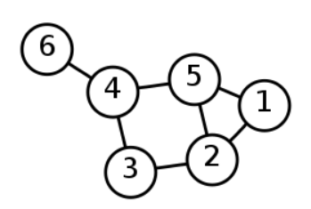
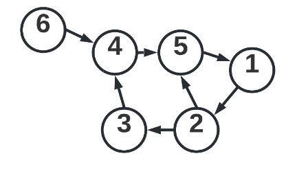
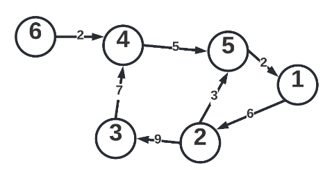
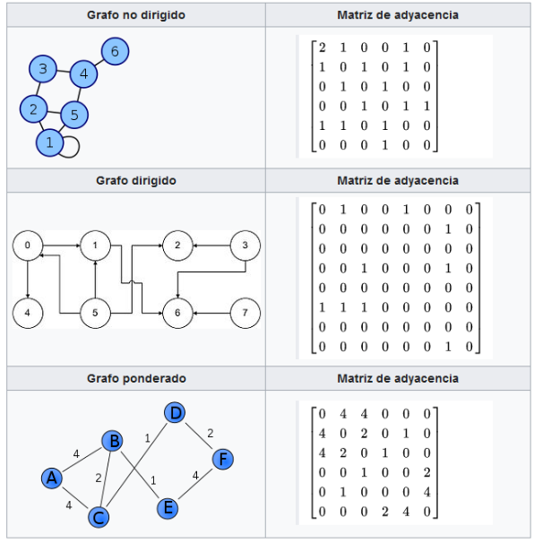
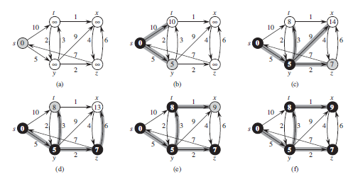
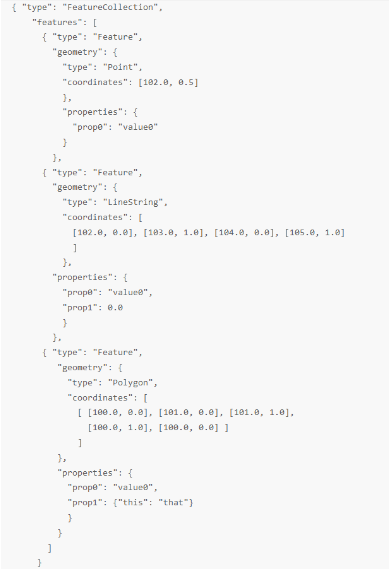
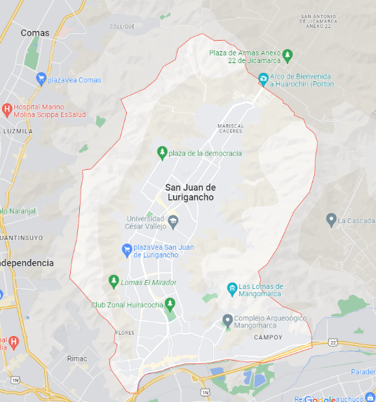
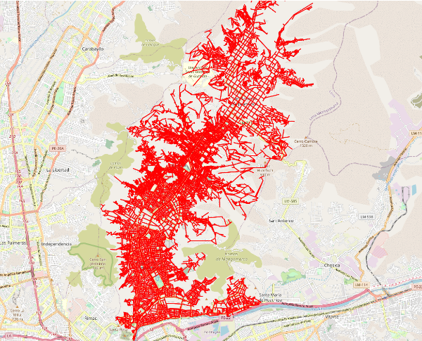
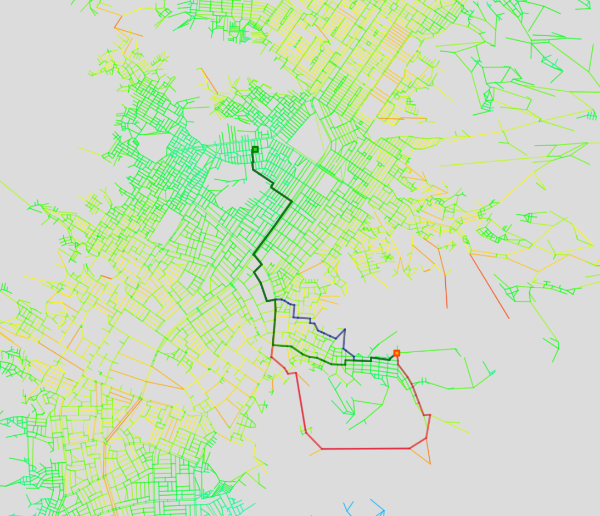

# Grupo 2

### Curso
CC184 - Complejidad Algorítmica

### Sección
CC41

### Integrantes
1. Bran Zapata, Estefano Sebastian (SebastianBran) - 201920151
2. Molina Diaz, Leonardo Raul (Lossani) - 201720651
3. Pineda Villa, Aaron Maxwell (thecatuniverse) - 201920080

### Docente
Luis Martin Canaval Sanchez

## Resumen Ejecutivo
El presente informe detalla todas las acciones implementadas para la realización del trabajo parcial para el curso de Complejidad Algorítmica, el cual consiste en el análisis y representación de un conjunto de datos, de calles e intersecciones de una ciudad grande, en formato de grafo.

Una de las grandes barreras a superar en este trabajo, es el procesamiento de grandes cantidades de datos, los cuales pueden ralentizar el rendimiento de cualquier implementación de lectura y procesamiento de datos. Por eso, es importante realizar e implementar un algoritmo que permite realizar dicha labor en un tiempo prudente y sin una excesiva complejidad algorítmica.

Finalmente, una de las principales motivaciones para la realización de este trabajo es poder comprender cómo funcionan muchos servicios o sistemas de navegación actuales; como es que realizan el almacenamiento, representación y procesamiento de sus datos; cuál es el proceso que realizan para encontrar el camino más corto entre dos ubicaciones y la manera en que se elige la mejor ruta considerando diversos factores.

## Objetivos
El presente trabajo parcial responde a los siguientes objetivos:

- Diseñar un algoritmo rápido y eficiente para la lectura y procesamiento de la información de las calles de una ciudad contenidas en un archivo geojson.
- Diseñar un algoritmo que represente y organice la información usando un gestión eficiente de los recursos de memoria y tiempo.
- Identificar una estructura de datos eficiente para la representación en formato de grafo de un gran conjunto de datos.
- Conseguir un conjunto de datos que contenga toda la información necesaria de las calles e intersecciones de una ciudad para un posterior análisis.

## Marco Teórico

### Grafos
Según Álvarez & Parra (2013), un grafo es una estructura matemática que nos permite modelar problemas de la vida cotidiana a través de una representación gráfica. Esto tiene dos componentes. Por un lado, los nodos o vértices representan a los actores. Por otro lado, los bordes o aristas representan asociaciones o relaciones entre actores. De manera similar, un gráfico puede representar un tipo de relación entre actores (simple) o muchos tipos de relaciones (muchos), y cada vínculo o relación puede ser dirigido.

<p align="center">
  
  <p align="center">Figura 1. Grafo no dirigido con 6 vértices y 7 aristas.</p>  
</p>

## Grafos dirigidos
Este grafo se utiliza para representar una dirección definida de las aristas, para esto se utiliza una flecha con la dirección específica.
<p align="center">
  
  <p align="center">Figura 2. Grafo dirigido con 6 vértices y 7 aristas.</p>  
</p>


## Grafos no dirigidos
En este grafo las aristas representan la conexión de los vértices en ambos sentidos, en este caso solo se utilizan líneas para representar las aristas.

<p align="center">
  
  <p align="center">Figura 3. Grafo no dirigido con 6 vértices y 7 aristas.</p>  
</p>

## Grafos ponderados
También conocido como grafo pesado o grafo con costos, este grafo se diferencia de los anteriores ya que tiene asociado un valor o etiqueta a cada arista.

<p align="center">
  
  <p align="center">Figura 4. Grafo ponderado con 6 vértices y 7 aristas.</p>  
</p>

## Matriz de adyacencias
Una matriz de adyacencia es una forma matemática de representar un grafo y sus conexiones. Representada por una matriz cuadrada del mismo número de entradas que nodos en un grafo.
Cada fila representa un nodo y las columnas de esta los nodos a los que puede estar conectado, el valor en cada posición determinaría el peso entre los nodos.
De esta manera, la posición (1, 2) determinaría el peso de la conexión entre el nodo 1 y el nodo 2.

<p align="center">
  
  <p align="center">Figura 5. Ejemplo de grafos expresados en matrices de adyacencia. Fuente: Wikipedia.</p>  
</p>

## Lista de adyacencias
Según Laaksonen (2017), en una representación de la lista de adyacencias, a cada nodo se le asigna una lista en la que solo se registran las relaciones entre los nodos vecinos. Además, las listas de afinidad son una de las formas más populares de representar gráficos, la mayoría de los cuales se pueden representar de manera eficiente, ya que es una de las representaciones que menos memoria ocupa. Por lo tanto, explicamos el concepto anterior de la siguiente manera:

$$
L_a: \text{Lista de adyacencia del nodo a} \\
E: \text{Conjunto de Aristas} \\
L_a = {b},\text{ si }(a,b)\in E
$$

Si el grafo es ponderado:

$$
P: \text{Peso de la arista entre dos nodos } (a, b) \\
L_a=\{(b, P)\}, \text{ si } (a, b) \in  E
$$

## Distancia entre dos puntos
Las calles son representadas por líneas rectas o aristas unidas continuamente, por lo tanto, tienen un inicio y final, estas terminaciones o vértices tienen una distancia lineal calculable, el cual es el módulo del vector que forman ambos nodos.
Para calcular dicha distancia se debe calcular la suma de los cuadrados de la diferencia entre sus coordenadas x e y, y finalmente obtener la raíz cuadrada de dicho valor.

$$
\text{Dado los puntos}: A(x_1,y_1) \text{ y } B(x_2,y_2)\\
d(A, B) = \sqrt{(x_2 - x_1)^2+(y_2 - y_1)^2}
$$ 

## Algoritmo de Dijkstra

El algoritmo de Dijkstra es un algoritmo de búsqueda de caminos más corto en grafos dirigidos y ponderados.

### Procedimiento del algoritmo

1. Se inicia marcando a todos los nodos como visitados, con distancia igual a -1 y con costo igual a infinito, excepto el nodo inicial que se marca con costo igual a 0.

2. Se toma el nodo inicial, se lo marca como el nodo actual y se agrega a un cola de prioridad ordenado por el peso.

3. Se toma el nodo actual y se recorren todo los nodos adyancente exceptos los que ya han sido visitados.

4. Luego, si la distancia del nodo actual es menor a la distancia del nodo adyacente, se actualiza la distancia del nodo adyacente y se agrega a la cola de prioridad junto con el nuevo peso.

5. Despues de recorrer todos los nodos adyacentes, se toma el nodo con menor distancia de la cola de prioridad y se lo marca como el nodo actual, repitiendo todo el proceso desde el punto 3.

6. Una vez finalizado el algoritmo, se obtiene la distancia de todos los nodos al nodo inicial.

<p align="center">
  
  <p align="center">Figura 6. Procedimiento del algoritmo de Dijkstra. Fuente: Introduction to Algorithms</p>  
</p>

## GeoJSON
Debido a la naturaleza de datos geográficos propia de nuestro proyecto, es necesario obtener datos representados bajo un estándar.

GeoJSON es un formato estándar abierto que permite describir datos geográficos simples y sus atributos respectivos. Está basado en el estándar JSON (JavaScript Object Notation) así que cualquier intérprete es capaz de leer el objeto que representa un GeoJSON. Este formato es ampliamente utilizado en cartografía.
Debido a que está basado en el estándar WKT del Open Geospatial Consortium, permite representar puntos (como marcadores en mapas), líneas (en el caso de calles o avenidas) o polígonos (para elementos complejos como países o estados)
Este estándar es utilizado por los principales servicios de mapas como Google Maps o Bing Maps.

Ejemplo de GeoJSON:

<p align="center">
  
  <p align="center">Figura 7. Ejemplo de GeoJSON.</p>  
</p>

## Imagen estática de la ciudad elegida
Para el presente trabajo, se eligió la ciudad la ciudad de San Juan de Lurigancho, la cual es un de las ciudades más pobladas de nuestro país y por lo tanto, poseé una gran cantidad de calles y avenidas que nos es de gran utilidad para la realización del análisis de datos y posterior aplicación de algoritmos de recorrido.

<p align="center">
  
  <p align="center">Figura 8. Mapa de San Juan de Lurigancho.</p>  
</p>

<p align="center">
  
  <p align="center">Figura 9. Calles marcadas de San Juan de Lurigancho.</p>  
</p>

# Descripción de los datos

## Datos consignados por calle
Para las calles, se almacenaron diversos tipos de datos que nos servirán para un análisis posterior y para cumplir los objetivos posteriores al trabajo parcial. Entre los datos consignados poseemos los siguientes:

- **osmid:** Identificador de la calle
- **name:** Nombre de la calle
- **highway:** Tipo de calle
- **oneway:** Boleano que indica si la calle de un solo sentido
- **lanes:** Número de carriles de la calle
- **maxspeed:** Velocidad máxima con el que se puede transitar por la calle
- **length:** Longitud de la calle
- **geometry:** Array que contiene coordenadas que definen la forma de la calle
- **source:** Id del intersección de origen de la calle
- **target:** Id de la intersección del fin de la calle
- **key:** Llave del recurso

## Datos consignados por intersección
Para las intersecciones, se almacenaron diversos tipos de datos que nos servirán para un análisis posterior y para cumplir los objetivos posteriores al trabajo parcial. Entre los datos consignados poseemos los siguientes:

- **x:** Coordenada de latitud
- **y:** Coordenada de longitud
- **street_count:** Contador de calles
- **id:** Identificador de la intersección

# Explicación de Implementación
Para la elaboración del grafo se realizaron una serie de pasos para poder obtener el resultado esperado. En primer lugar, para la obtención de la data necesaria para el trabajo parcial, usamos una librería de python llamada OSMnx, que nos permite obtener la información de las calles de una ciudad mediante OpenStreetMap. En segundo lugar, luego de obtener los datos, procedimos a exportar los datos obtenidos a un archivo json. En tercer lugar, una vez convertidos los datos a un archivo json, procedimos a crear un algoritmo de lectura para poder tranformar la información a un formato de datos que permitiría mostrar las calles y caminos mediante una aplicación web.

```python
def generateAdjacencyListForUI(adjacencyListPath, streetsPath):
    adjacencyList = {}
    streets = {}
    curr_time = datetime.now().hour
    keyValues = {}

    def initData():
        with open(adjacencyListPath, mode="r", encoding="utf-8") as f:
            nonlocal adjacencyList
            adjacencyList = json.load(f)
            adjacencyList = [(int(key), value) for key, value in adjacencyList.items()]
            adjacencyList = sorted(adjacencyList, key=lambda x: x[0])

            i = 0
            for key, val in adjacencyList:
                keyValues[key] = i
                i += 1

        with open(streetsPath, mode="r", encoding="utf-8") as f:
            nonlocal streets
            streetsList = json.load(f)

            for element in streetsList:
                k, v = element

                key = tuple(element[k])
                value = element[v]

                streets[key] = value

    def traffic_by_hour(time):
        factor = round(5 * math.cos(2 * (time / 3) - 1) * math.sin((time / 6) - 2) + 5, 3)
        if factor > 10: return 10
        if factor < 0: return 0
        return factor

    def calculate_traffic_factor(val, time):
        value = val * traffic_by_hour(time)
        return value / 10

    def calculate_weight(val, length, time):
        return calculate_traffic_factor(val, time) * math.log10(length)

    def getWeight(city1, city2):
        street = streets[(city1, city2)]
        val = street["val"]
        length = street["length"]
        return calculate_weight(val, length, curr_time)

    def getNewAdjacencyList():
        nonlocal adjacencyList
        nonlocal keyValues
        newAdjacencyList = []
        for key, arr in adjacencyList:
            newAdjacencyList.append(list(map(lambda x: (keyValues[x], getWeight(key, x)), arr)))
        return newAdjacencyList

    initData()
    return getNewAdjacencyList()


def generateLocationListForUI(intersectionsPath):
    with open(intersectionsPath) as file:
        data = json.load(file)
        data = [(int(key), (value['x'], value['y'])) for key, value in data.items()]
        data = sorted(data, key=lambda x: x[0])

    locations = []
    for k, v in data:
        locations.append(v)

    return locations
```

En ese sentido, en nuestra lista de adyacencias del grafo, un vértice significa una intersección entre dos o más calles y, por otro lado, una arista representa una calle.

## Hallar el camino más corto y caminos alternativos

Por otro lado, para encontrar el camino más corto y los caminos alternativos entre un par de nodos o ubicaciones, se implementaron algoritmos de búsqueda de caminos. En nuestro caso, hemos implementado el algoritmo de Dijkstra. En este algoritmo, se calcula el camino más corto entre un nodo y todos los demás. Luego de hacer el calculo desde el nodo inicial, se reconstruye el camino desde el nodo final. Además, agregamos una pequeña varianción, para el algoritmo devuelva un par de nodo que conforman la arista de mayor peso, que se utilizará posteriormente para poder usarlo para hallar un camino alternativo.

```python
def dijkstra(G, s, t):
    n = len(G)
    visited = [False] * n
    path = [-1] * n
    cost = [math.inf] * n

    cost[s] = 0
    pqueue = [(0, s)]

    higher = 0
    poshs = [0, 0]

    while pqueue:
        g, u = hq.heappop(pqueue)
        if not visited[u]:
            visited[u] = True
            for v, w in G[u]:
                if not visited[v]:
                    f = g + w
                    if f < cost[v]:
                        cost[v] = f
                        path[v] = u
                        hq.heappush(pqueue, (f, v))

    head = t
    while path[head] != -1:
        for v, w in G[head]:
            if w > higher:
                higher = w
                poshs = [v, head]
        head = path[head];

    return path, cost, poshs
```

Por otro lado, para encontrar los caminos alternativos entre un par de nodos o ubicaciones, se utiliza un algoritmo para quitar las aristas de mayor peso del grafo a partir de la información devuelta por el algoritmo anterior. Luego, se vuelve a llamar al algoritmo de Dijkstra, enviandole el nuevo grafo y, de esta manera, se hallará un camino alternativo distinto al camino más corto.

```python	
def dijkstraPaths(G1, s, t, higher):
    G2 = copy.deepcopy(G1)

    for h in higher:
        G2[h] = []
        g = False
        i = 0
        while not g:
            i += 1
            g = True
            for j in G2[i]:
                if h in j:
                    i = 0
                    g = False
                    G2[i].remove(j)

    path, cost, posh = dijkstra(G2, s, t)

    return path, cost, posh
``` 

<p align="center">
  
  <p align="center">Figura 10. Trazo del camino más corto y caminos alternativos.</p>  
</p>


# Conclusiones

* A lo largo del desarrollo del proyecto hemos alcanzado todos los objetivos satisfactoriamente, haciendo uso de diferentes conocimientos adquiridos en el curso. El presente proyecto permitió implementar una situación real a través de un algoritmo que trabaja con grandes cantidades de datos de manera eficiente y útil.


# Bibliografía

Álvares, M. & Parra, J. (2013). Teoría de grafos. Recuperado de https://bit.ly/2Q6mEub [Consulta: 29 de abril de 2022].

ArcGIS (2021). Portal for ArcGIS: GeoJSON. Recuperado de https://bit.ly/3w3JynE [Consulta: 1 de mayo de 2022].

Cormen, T., Leiserson, C., Rivest, R. & Stein, C (2009). Introduction to Algorithms. Thrid edition. Recuperado de https://bit.ly/3NG8KHo [Consulta: 1 de abril de 2022].

Laaksonen, A. (2017). Competitive Programmer's Handbook. Recuperado de https://bit.ly/3sWDlqt [Consulta: 29 de abril de 2022].